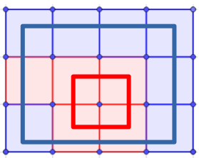
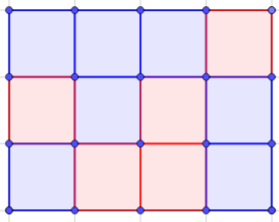

.. _tuto_bcp:

========================
Board Coloration problem
========================

.. include:: menu_backto.rst

Brief description
=================

Given a squared board with dimension n*m, the goal is to colored the squares so any given rectangle included inside the board doesn't have each corner colored with the same color. 

For examples, this is not a valid solution of the 3*4 problem, because the red and blue square have both their 4 corner with the same color:

On the contrary the folowing coloration is a valid solution of the 3*4 problem because every given rectangle inside the board don't have matching color corner:

CFN model
=========

We create n*m variables, one for each square of the board, with domain size equal to n*m representing all the possible color. We also create one variable for the number of color.

We create hard quaterny constraints for every rectangle inside the board with cost equal to 0 if the 4 variable have different value and top if not.

We then create hard binary constraints with the variable of the number of color for each square to fix the variable for the number of color as an upper bound.

Then we create a soft constraints on the number of color to minimize it.

Python model solver
===================

The following code using python3 interpreter will solve the board coloration problem with the first two arguments being the dimension n and m of the board (e.g. "python3 BoardColoration.py 8").

:download:`BoardColoration.py<../../../web/TUTORIALS/BoardColoration.py>`

.. literalinclude:: ../../../web/TUTORIALS/BoardColoration.py

